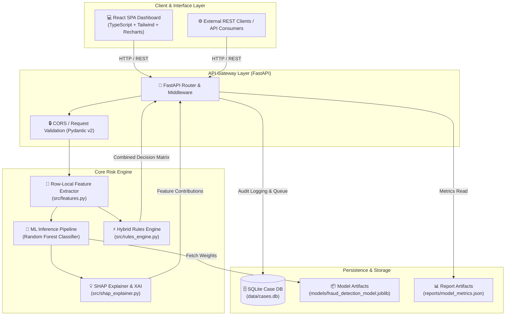
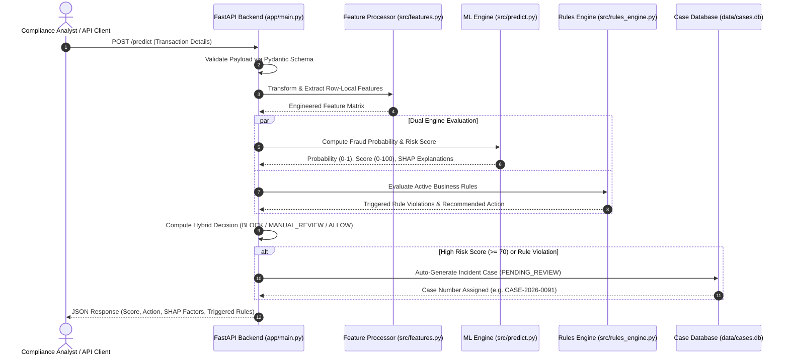
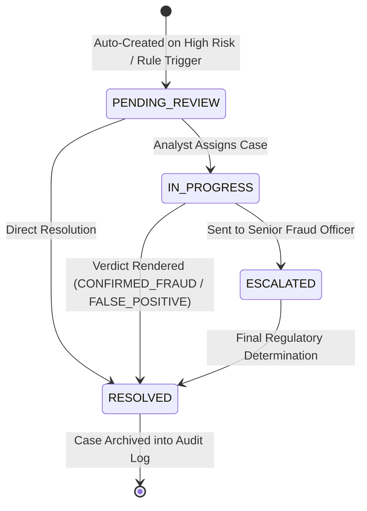

<div align="center">

# 🛡️ FraudShield AI Enterprise
### AI-Powered Financial Risk Intelligence, Rules Engine & Case Management Platform

[](https://www.python.org/)
[](https://fastapi.tiangolo.com/)
[](https://react.dev/)
[](https://www.typescriptlang.org/)
[](https://tailwindcss.com/)
[](https://scikit-learn.org/)
[](https://www.docker.com/)
[](LICENSE)

---

**FraudShield AI Enterprise** is a production-grade, full-stack fraud detection and risk intelligence platform. Combining a trained Machine Learning pipeline with a deterministic Hybrid Rules Engine, SHAP Explainable AI (XAI), SQLite Analyst Case Management, and a 13-page dark-themed React dashboard, FraudShield AI analyzes PaySim-style financial transaction streams in real time.

</div>

> [!WARNING]
> **Model Disclaimer:** FraudShield AI provides automated probability estimates and rule evaluation for transaction risk. High-risk predictions should be reviewed by authorized compliance officers using established organizational risk procedures.

---

## 📋 Table of Contents

- [Architectural Overview](#-architectural-overview)
- [System Sequence & Data Flow](#-system-sequence--data-flow)
- [Machine Learning & Rules Engine Pipeline](#-machine-learning--rules-engine-pipeline)
- [Analyst Case Lifecycle State Machine](#-analyst-case-lifecycle-state-machine)
- [Key Features](#-key-features)
- [Tech Stack](#-tech-stack)
- [Quick Start & Installation](#-quick-start--installation)
- [API Reference](#-api-reference)
- [Model Performance & Benchmarks](#-model-performance--benchmarks)
- [Project Structure](#-project-structure)
- [Enterprise Limitations & Future Roadmap](#-enterprise-limitations--future-roadmap)
- [License](#-license)

---

## 📐 Architectural Overview

FraudShield AI Enterprise adopts a decoupled micro-architecture where the FastAPI service operates both as a high-performance REST API and as an enterprise asset server for the single-page application (SPA).



---

## 🔄 System Sequence & Data Flow

The diagram below details how single transactions and bulk CSV/XLSX batches navigate through validation, feature engineering, dual ML + Rules evaluation, and case queue creation.



---

## 🧪 Machine Learning & Rules Engine Pipeline

FraudShield AI relies on a **Hybrid Decision Matrix** that synthesizes probabilistic ML models with deterministic business constraints to eliminate zero-day fraud blind spots.

```mermaid
flowchart LR
    subgraph InputData ["Raw Transaction Input"]
        In["type, amount, oldbalanceOrg,\nnewbalanceOrig, oldbalanceDest, newbalanceDest"]
    end

    subgraph FeatureEngineering ["Feature Engineering Module"]
        F1["log_amount"]
        F2["origin_balance_change"]
        F3["destination_balance_change"]
        F4["origin_balance_error"]
        F5["destination_balance_error"]
        F6["amount_to_origin_balance"]
        F7["unusually_high_amount"]
    end

    subgraph DualScoring ["Dual Scoring Systems"]
        MLModel["🤖 Trained Random Forest Classifier\nProbability: P(Fraud)"]
        RuleSys["⚡ Business Rule Matrix\nRULE-001 to RULE-004"]
    end

    subgraph DecisionMatrix ["Hybrid Decision Aggregator"]
        Dec{"P(Fraud) >= 0.70 OR\nCritical Rule Triggered?"}
        ActBlock["🚫 BLOCK (High Risk)"]
        ActReview["⚠️ MANUAL REVIEW (Medium Risk)"]
        ActAllow["✅ ALLOW (Low Risk)"]
    end

    In --> FeatureEngineering
    FeatureEngineering --> MLModel
    FeatureEngineering --> RuleSys
    MLModel --> Dec
    RuleSys --> Dec
    Dec -->|P >= 0.70 or Rule-001| ActBlock
    Dec -->|0.30 <= P < 0.70| ActReview
    Dec -->|P < 0.30| ActAllow
```



---

## 🗂️ Analyst Case Lifecycle State Machine

When transactions trigger high risk or rule violations, an analyst ticket is auto-generated into an SQLite-backed queue. Compliance analysts can transition cases through their investigation lifecycle.



---

## ✨ Key Features

- **⚡ Real-Time Single & Batch Inference:** Evaluate individual transactions in <20ms or upload bulk datasets (CSV/XLSX) with dataset profiling.
- **🧠 SHAP-Based Explainable AI:** Inspect exact feature contributions (positive/negative impact factors) driving every prediction score.
- **🛡️ Hybrid Business Rules Engine:** Define, enable/disable, and evaluate custom deterministic rules alongside probabilistic ML models.
- **📋 Analyst Incident Management:** SQLite-backed investigation queue with workflow assignment, priority tagging, and verdict history tracking.
- **📊 Interactive Model Performance Analytics:** Real-time visual metrics including ROC curves, Precision-Recall curves, confusion matrices, and model comparison suites.
- **📥 Audit-Ready Reporting:** Export comprehensive risk assessment and case resolution reports directly in formatted CSV or Excel (`.xlsx`) formats.
- **🎨 Modern Dark-Themed UI:** 13 specialized dashboard pages built with React 18, Tailwind CSS, Lucide icons, and interactive Recharts visualizations.

---

## 🛠️ Tech Stack

| Domain | Technology / Framework | Purpose |
| :--- | :--- | :--- |
| **Frontend UI** | React 18, TypeScript, Vite | Component-driven UI framework & build tool |
| **Styling & Assets** | Tailwind CSS, Lucide React, Recharts | Responsive dark design, icons & charts |
| **Backend API** | FastAPI, Uvicorn, Pydantic v2 | High-concurrency Python REST API framework |
| **ML Engine** | scikit-learn, Imbalanced-learn, Joblib | Model training, SMOTE balancing & serialization |
| **Data Processing** | Pandas, NumPy, OpenPyXL | Data wrangling, feature extraction & XLSX export |
| **XAI & Rules** | SHAP, Custom Python Rules Engine | Feature explainability & business logic rules |
| **Database** | SQLite3 | Persistent analyst case storage & operational queue |
| **Testing** | Pytest, HTTPX | Automated unit testing & API verification |
| **Containerization** | Docker, Docker Compose | Container deployment & service orchestration |

---

## ⚡ Quick Start & Installation

### Prerequisites
- **Python:** 3.11 or higher
- **Node.js:** 18.0 or higher (for building frontend)
- **Git**

---

### Option 1: Native Local Installation

#### 1. Clone Repository & Setup Virtual Environment
```bash
git clone https://github.com/rahulbh8077/Fraud-Detection-System.git
cd "Fraud-Detection-System"

# Create and activate virtual environment
python -m venv .venv
# On Windows PowerShell:
.venv\Scripts\Activate.ps1
# On Linux/macOS:
source .venv/bin/activate

# Install Python dependencies
pip install -r requirements.txt
```

#### 2. Generate Synthetic Data & Train ML Models
```bash
# Generate 100k demo transactions
python -m src.generate_demo_data

# Train Random Forest, Gradient Boosting, Decision Tree & Logistic Regression models
python -m src.train data/raw/demo_transactions.csv
```

#### 3. Build React Frontend
```bash
cd frontend
npm install
npm run build
cd ..
```

#### 4. Launch FastAPI Server
```bash
python -m uvicorn app.main:app --host 0.0.0.0 --port 8000
```
- 🌐 **Web Dashboard:** [http://localhost:8000](http://localhost:8000)
- 📖 **Interactive Swagger API Docs:** [http://localhost:8000/api/docs](http://localhost:8000/api/docs)
- 📑 **ReDoc Documentation:** [http://localhost:8000/api/redoc](http://localhost:8000/api/redoc)

---

### Option 2: Docker Compose Setup

Run the full system inside isolated Docker containers with a single command:

```bash
docker-compose up --build
```
- Access API & Dashboard at `http://localhost:8000`
- Access legacy Streamlit dashboard (optional) at `http://localhost:8501`

---

## 📡 API Reference

### Core Endpoints

| Endpoint | Method | Tag | Description |
| :--- | :--- | :--- | :--- |
| `/health` | `GET` | System | System status, latency, service dependency check |
| `/model-info` | `GET` | Model | Full metrics, confusion matrix & ROC curve data |
| `/predict` | `POST` | Prediction | Single transaction risk analysis + SHAP + Rules |
| `/predict/batch` | `POST` | Prediction | Upload CSV/XLSX batch transaction file |
| `/rules` | `GET` | Rules Engine | List active enterprise business rules |
| `/cases` | `GET` | Case Manager| List analyst investigation queue cases |
| `/cases/{case_number}` | `PATCH` | Case Manager| Update case status, notes, or analyst verdict |
| `/reports/download-csv` | `POST` | Reports | Generate & download CSV report |
| `/reports/download-xlsx` | `POST` | Reports | Generate & download XLSX formatted report |

---

### Example Request & Response Payload (`POST /predict`)

#### Request Body
```json
{
  "step": 12,
  "type": "TRANSFER",
  "amount": 185000.0,
  "oldbalanceOrg": 200000.0,
  "newbalanceOrig": 15000.0,
  "oldbalanceDest": 0.0,
  "newbalanceDest": 0.0
}
```

#### Response Body
```json
{
  "prediction": "FRAUDULENT",
  "fraud_probability": 0.942,
  "risk_score": 94,
  "risk_level": "HIGH",
  "recommended_action": "BLOCK",
  "decision_reason": "High ML probability (0.942) exceeds threshold. Triggered 1 business rules.",
  "explanation": [
    {
      "feature": "destination_balance_error",
      "impact": 0.385,
      "direction": "RISK_INCREASE",
      "description": "Destination balance error of +185,000.00 suggests balance manipulation."
    },
    {
      "feature": "amount_to_origin_balance",
      "impact": 0.210,
      "direction": "RISK_INCREASE",
      "description": "Transaction drains 92.5% of origin balance."
    }
  ],
  "rules_triggered": [
    {
      "id": "RULE-001",
      "name": "High-Value Drain to Empty Destination",
      "action": "BLOCK",
      "severity": "CRITICAL"
    }
  ],
  "model_name": "Random Forest",
  "model_version": "2.0"
}
```

---

## 📈 Model Performance & Benchmarks

Models were evaluated on a class-imbalanced synthetic financial transaction dataset (100,000 transactions). Models were tuned to prioritize **PR-AUC** and **Recall** to minimize false negatives in financial fraud.

| Model Algorithm | PR-AUC | ROC-AUC | Precision | Recall | F1-Score | Status |
| :--- | :---: | :---: | :---: | :---: | :---: | :---: |
| **Random Forest Classifier** | **0.8107** | **0.9905** | **74.83%** | **80.67%** | **77.64%** | **Selected ✓** |
| Gradient Boosting Machine | 0.7842 | 0.9812 | 71.20% | 81.41% | 75.96% | Candidate |
| Decision Tree Classifier | 0.7879 | 0.9654 | 67.45% | 97.77% | 79.83% | Candidate |
| Logistic Regression | 0.7986 | 0.9780 | 62.10% | 99.63% | 76.51% | Candidate |

> 📊 Detailed confusion matrix, feature importance arrays, and precision-recall curves are exported into `reports/model_metrics.json`.

---

## 📁 Project Structure

```
Fraud-Detection-System/
├── app/
│   └── main.py                 # FastAPI backend router, schemas & static server
├── src/
│   ├── analytics.py            # Dataset analytics & metrics computer
│   ├── case_manager.py         # SQLite case queue persistence engine
│   ├── config.py               # Enterprise global paths & constants
│   ├── data_preprocessing.py   # Dataset validation & quality auditing
│   ├── features.py             # Feature engineering transformer
│   ├── generate_demo_data.py   # Synthetic 100K transaction generator
│   ├── predict.py              # Inference pipeline & explanation binder
│   ├── report_generator.py     # CSV & OpenPyXL Excel export formatter
│   ├── rules_engine.py         # Configurable hybrid business rules matrix
│   ├── shap_explainer.py       # SHAP TreeExplainer & feature attributions
│   └── train.py                # Multi-model evaluation & training script
├── frontend/
│   ├── public/                 # Favicons & SVG assets
│   ├── src/
│   │   ├── api/client.ts       # Typed Axios API client
│   │   ├── components/         # Reusable UI library (Layout, Cards, Badges)
│   │   ├── pages/              # 13 Dashboard views (Risk, Rules, Cases, XAI)
│   │   ├── types/index.ts      # TypeScript interfaces
│   │   └── App.tsx             # Main routing hub
│   ├── dist/                   # Production build asset directory
│   ├── package.json            # Node.js dependencies
│   ├── tailwind.config.js      # Tailwind CSS configuration
│   └── vite.config.ts          # Vite build settings
├── models/
│   └── fraud_detection_model.joblib # Serialized ML pipeline model
├── reports/
│   └── model_metrics.json      # Model performance benchmarks
├── data/
│   ├── raw/                    # Raw input dataset directory
│   └── cases.db                # SQLite analyst case database
├── tests/                      # Pytest automated test suite
├── Dockerfile                  # Production container definition
├── docker-compose.yml          # Multi-container orchestration setup
├── requirements.txt            # Python dependencies
└── README.md                   # Project documentation
```

---

## ⚠️ Enterprise Limitations & Future Roadmap

- **Streaming Ingestion:** Current pipeline supports HTTP REST and batch file uploads. Streaming ingestion via Apache Kafka / AWS Kinesis is planned for v3.0.
- **Calibrated Probabilities:** Future updates will introduce Platt Scaling & Isotonic Regression to output calibrated financial loss probabilities.
- **Authentication & RBAC:** Production deployments should integrate OAuth2/OIDC JWT authentication to secure compliance endpoints.

---

## 📜 License

Distributed under the **MIT License**. See [`LICENSE`](LICENSE) for details.

---

<div align="center">

Made with ❤️ by **[Rahul](https://github.com/rahulbh8077)**

</div>
